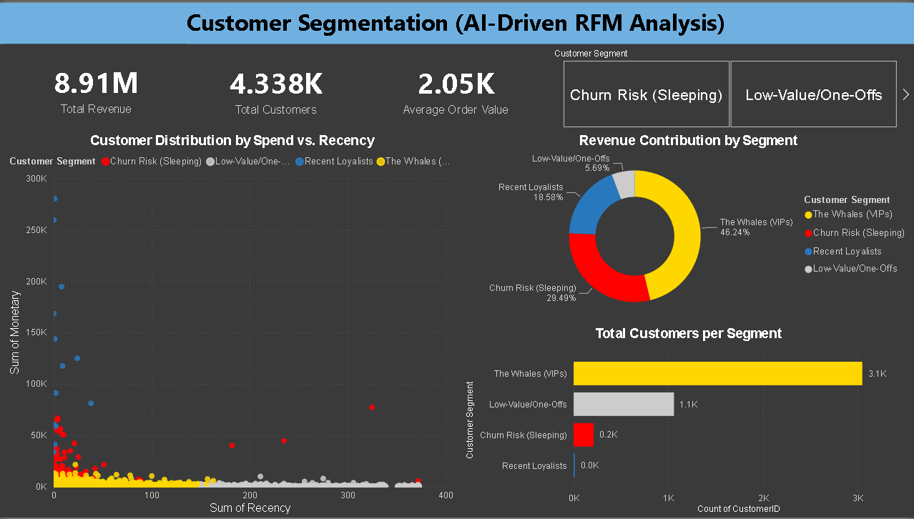

# 🧠 AI-Driven Customer Segmentation (RFM Analysis)

## 📌 Objective
The goal of this project was to move beyond basic descriptive analytics and use machine learning to uncover hidden customer purchasing behaviors. By engineering an RFM (Recency, Frequency, Monetary) matrix and applying a K-Means clustering algorithm, I segmented a customer base into distinct actionable groups to optimize targeted marketing and reduce churn.

## 🛠️ Tech Stack Used
* **Data Engineering (SQL):** Cleaned half a million rows of raw transactional data and engineered a custom View to calculate exact RFM metrics for each unique customer.
* **Machine Learning (Python):** Connected directly to the SQL database using `pyodbc`, scaled the data using `scikit-learn`, and built a K-Means clustering model to assign algorithmic segments.
* **Business Intelligence (Power BI):** Designed an interactive, dark-themed dashboard using DAX to translate the ML clusters into business-ready insights.

## 📸 Dashboard Preview

## 🔍 Key Insights & Strategy
The machine learning algorithm identified 4 distinct customer personas across 4,372 unique buyers:
1. **Mega-Whales (VIPs):** While a smaller portion of the customer base, this group accounts for the vast majority of the $8.91M total revenue, with an exceptionally high Average Order Value. *Strategy: White-glove service and exclusive early access.*
2. **Recent Loyalists:** Healthy, engaged customers with recent purchases. *Strategy: Upsell and loyalty programs.*
3. **Churn Risk:** Customers who historically spent well but have a dangerously high 'Recency' score (haven't bought in a long time). *Strategy: Aggressive win-back email campaigns and targeted discounts.*
4. **Low-Value/One-Offs:** Low spend, low frequency. *Strategy: Minimize marketing spend here to maximize ROI on the VIPs.*
